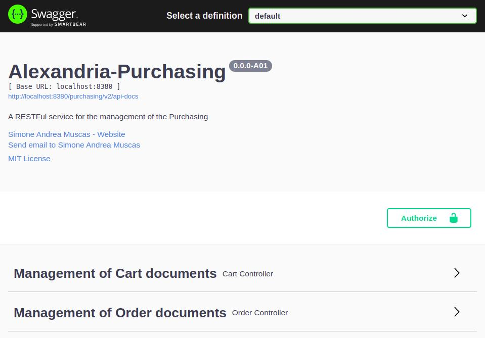

## alexandria-Purchasing
> Spring Purchasing Management (Case Study)

A RESTFul micro-service for the management of the Purchasing of Alexandria Online Shop.


## Motivation
This project is aimed on enforcing the knowledge of Spring Framework, REST services
and related technologies with emphasis on testability.


## Technologies
Project is created with:
* Java 11
* Maven
* Spring Boot 2.5.1
* Spring Web
* Spring Data
* Spring Security
* Jackson 2.11.1
* Swagger 3.0.0
* Lombok 1.18.20


## Features
- [x] Purchasing management
- [x] Security management (JSON authentication)


## Setup
alexandria-Purchasing is a [Spring Boot](https://spring.io/guides/gs/spring-boot) application built using [Maven](https://spring.io/guides/gs/maven/). You can build a jar file and run it from the command line:


```
git clone https://github.com/niolikon/alexandria-Purchasing.git
cd alexandria-Purchasing
./mvnw package
java -jar target/*.jar
```

## Documentation
The exported RESTFul APIs are documented using [Swagger framework](https://swagger.io/), you can access the provided documentation by running alexandria-Purchasing and opening [Swing UI](http://localhost:8380/purchasing/swagger-ui/) on your browser.



Please use the <b>Authorize</b> button to test the CRUD operations with different user profiles.


# License

The alexandria-Purchasing (Case Study) application is released under [MIT License](LICENSE).
